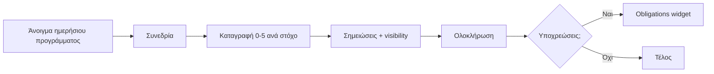
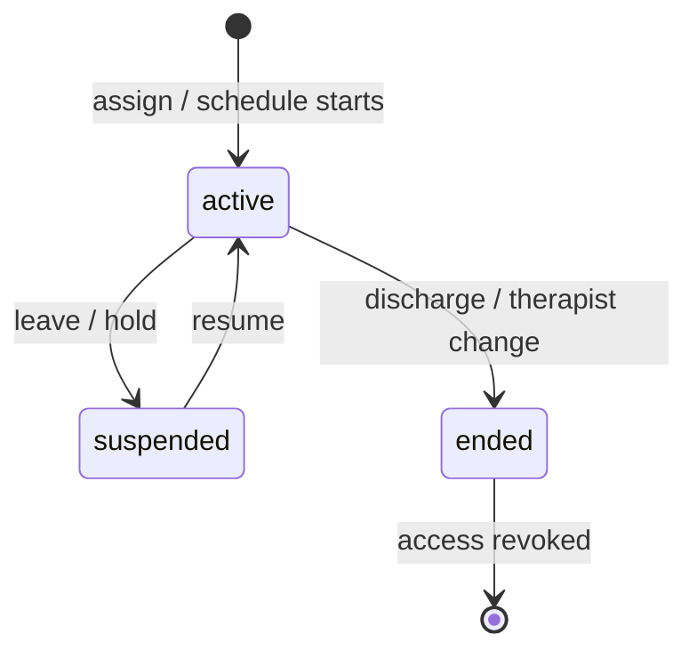

# Clinical Core Architecture

**Status:** Architecture & design sprint (documentation only — no full implementation)  
**Last updated:** 2026-05-15  
**Audience:** Product, engineering, clinical leads  
**Related:** [access-boundaries.md](./access-boundaries.md), [child-profile-architecture.md](./child-profile-architecture.md), [secretary-vs-clinical-responsibilities.md](./secretary-vs-clinical-responsibilities.md)

---

## 1. Purpose

This document defines the **full clinical / educational / therapeutic layer** of the multidisciplinary therapy center platform. It is the authoritative map for:

- what data exists in the clinical domain  
- how therapists, supervisors, and clinical leadership interact with it  
- how clinical data stays **separated** from secretary, financial, and parent-facing surfaces  
- how future implementation phases should be ordered  

**Out of scope for this layer:** payments, reminders, diagnosis renewal logistics, GDPR consent admin, operational reports kanban — see [secretary-vs-clinical-responsibilities.md](./secretary-vs-clinical-responsibilities.md).

---

## 2. Core principles (non-negotiable)

| # | Principle | Implementation expectation |
|---|-----------|----------------------------|
| 1 | **Assigned children only** | Therapists read/write clinical records only when an active `therapist_child_assignment` exists. |
| 2 | **Assignment end = access end** | When assignment `ends_at` passes or status → `ended`, therapist loses access automatically (API + RLS + UI). |
| 3 | **Clinical data minimization** | Secretary never loads session note bodies or confidential fields on clinical routes. |
| 4 | **Module separation** | Clinical routes under `/children`, `/therapy-goals`, `/session-notes`, clinical reports — not under `/secretary/*`. |
| 5 | **Two visibility tiers** | **General clinical** vs **confidential / restricted** — see [confidential-clinical-notes.md](./confidential-clinical-notes.md). |
| 6 | **Measurable goals** | All therapeutic goals use 0–5 scale with baseline, criterion, session-linked scores — see [goal-scoring-system.md](./goal-scoring-system.md). |
| 7 | **Auditability** | Clinical record access and confidential exports are logged. |

---

## 3. Architectural layers

```
┌─────────────────────────────────────────────────────────────────────────┐
│  Presentation (Greek UI)                                                 │
│  Child Clinical File · Session Quick Capture · Goals · Charts · Reports   │
└─────────────────────────────────────────────────────────────────────────┘
                                    │
┌───────────────────────────────────▼─────────────────────────────────────┐
│  Application services (server actions / API)                             │
│  Access guard · Assignment resolver · Report composer · Chart aggregator   │
└─────────────────────────────────────────────────────────────────────────┘
                                    │
┌───────────────────────────────────▼─────────────────────────────────────┐
│  Clinical read models                                                    │
│  ChildClinicalBundle · GoalProgressMap · DomainProgress · Obligations    │
└─────────────────────────────────────────────────────────────────────────┘
                                    │
┌───────────────────────────────────▼─────────────────────────────────────┐
│  Domain entities (Postgres / Supabase — proposed extensions)               │
│  assignments · goals · session_goal_scores · evaluations · dev history   │
└─────────────────────────────────────────────────────────────────────────┘
                                    │
┌───────────────────────────────────▼─────────────────────────────────────┐
│  Policy enforcement                                                      │
│  RBAC (RoleCode) · RLS · field-level note visibility · audit_log          │
└─────────────────────────────────────────────────────────────────────────┘
```

**Existing codebase alignment:**

| Area | Current location | Sprint target |
|------|------------------|---------------|
| Child clinical bundle | `lib/data/clinical-child-profile/`, `lib/clinical/child-profile/` | Extend with assignments + scoring |
| Therapy goals | `lib/data/therapy-goals/` | Add 0–5 scale, domains, baselines |
| Session notes | `lib/data/session-notes/` | Link to goal scores + visibility |
| Permissions | `lib/clinical/child-profile/permissions.ts`, `lib/gdpr/permissions.ts` | Assignment-aware guards |
| Child profile UI | `/children/[id]`, `components/children/clinical-profile/` | Workflow rail per §7 |

---

## 4. Domain modules (clinical system map)

| Module | System of record | Primary users | Route pattern (target) |
|--------|------------------|---------------|-------------------------|
| **Therapist access** | `therapist_child_assignments` | Admin, CD, auto from schedule | Policy layer (all routes) |
| **Child clinical file** | Aggregated bundle | Therapist, supervisor, CD | `/children/[id]` |
| **Evaluations** | `clinical_evaluations` + templates | Therapists, psychologists | `/children/[id]?tab=evaluations` |
| **Developmental history** | `developmental_history` | Psychologist, social worker | `/children/[id]?tab=dev-history` |
| **Measurable goals** | `therapy_goals` + `session_goal_scores` | Therapists | `/therapy-goals`, child tab |
| **Session documentation** | `session_notes` + scores | Therapists | Post-session flow |
| **Progress charts** | Derived read model | Therapist, supervisor, CD | Child tab «Πρόοδος» |
| **Progress reports** | `progress_reports` | Therapist → supervisor → CD | Clinical reports workflow |
| **Confidential addendum** | `confidential_clinical_notes` | Supervisor, CD, management | Separate export / tab |
| **Therapist obligations** | Derived dashboard | Therapist, supervisor | `/clinical/obligations` or home widget |

---

## 5. Proposed data model (conceptual)

### 5.1 Access & audit

```
therapist_child_assignments
  id, organization_id, child_id, therapist_user_id
  discipline_code (nullable = caseload without single discipline)
  starts_at, ends_at (nullable = open-ended)
  status: active | ended | suspended
  assigned_by, ended_reason, created_at

clinical_access_audit_log
  id, user_id, child_id, resource_type, resource_id
  action: view | export | print
  occurred_at, ip_hash (optional)
```

**Rule:** Therapist `SELECT` on any child-scoped clinical row requires `EXISTS (assignment WHERE active AND child_id match)`.

Supervisor scope: `supervisor_scope` (department / center / discipline list) OR explicit `supervisor_child_access` — not all children by default unless CD.

Clinical Director (`ORG_ADMIN` clinical policy): org-wide clinical read; confidential per field policy.

### 5.2 Clinical documentation

```
therapy_goals (extend existing)
  + domain_code (ProgressDomain enum)
  + baseline_score (0-5), target_score (0-5)
  + measurable_description (required)
  + measurement_method (optional rubric text)

session_goal_scores (new)
  session_id, goal_id, therapist_user_id
  performance_score (0-5), recorded_at
  qualitative_note (short)

session_notes (extend)
  + visibility: parent_visible | clinical_general | supervisor_only | confidential
  + engagement_level, participation_notes, behavior_notes (structured optional)

clinical_evaluations (new)
  child_id, template_id, specialty_code
  status: draft | in_review | finalized
  section_responses JSONB (validated by template schema)
  supervisor_review, finalized_at, author_id

evaluation_templates (new, org-scoped)
  specialty_code, version, schema JSONB, is_active

developmental_history (new)
  child_id, status, completed_by_role
  sections JSONB (pregnancy, milestones, medical, ...)
  responsible: psychologist | social_worker signatures
```

### 5.3 Reports

```
progress_reports (extend)
  reporting_period_start, reporting_period_end
  generated_snapshot JSONB (goals, domains, specialties — no confidential)
  parent_visible_body, clinical_summary

confidential_report_addenda (new)
  progress_report_id OR child_id + period
  body (restricted), visible_to_roles[]
```

Detail in linked docs.

### 5.4 Developmental history (`developmental_history`)

**Responsible roles:** Ψυχολόγος, Κοινωνικός Λειτουργός (edit); therapists read summary only unless also assigned in that role.

| Field | Description |
|-------|-------------|
| `id`, `child_id`, `organization_id` | |
| `status` | `draft`, `in_review`, `completed` |
| `completed_by_user_id` | Primary author |
| `co_signer_user_id` | Optional second role (psych + SW) |
| `completed_at` | |
| `sections` | JSONB — fixed section keys below |

**Fixed sections (all required for `completed`):**

| Section key | Title (EL) | Content |
|-------------|------------|---------|
| `pregnancy_birth` | Κύηση & γέννηση | Term, complications, birth weight, NICU |
| `developmental_milestones` | Αναπτυξιακά ορόσημα | Motor, language, social milestones vs norms |
| `medical_history` | Ιατρικό ιστορικό | Diagnoses, medications, hospitalizations |
| `family_history` | Οικογενειακό ιστορικό | Structure, stressors, hereditary concerns |
| `school_history` | Σχολικό ιστορικό | Placement, IEP, academic/social functioning |
| `social_emotional` | Κοινωνικό / συναισθηματικό | Relationships, regulation, trauma screen (clinical) |
| `communication_language` | Επικοινωνία & γλώσσα | Receptive/expressive history |
| `sensory_motor` | Αισθητηριακό / κινητικό | Sensory profile, motor delays |
| `behavior_concerns` | Συμπεριφορικές ανησυχίες | Frequency, triggers, interventions tried |
| `parent_concerns` | Ανησυχίες γονέων | Verbatim themes (parent-visible subset optional) |
| `previous_assessments` | Προηγούμενες αξιολογήσεις / παρεμβάσεις | External reports, prior therapy |

**Visibility:** General clinical on completion; sensitive family risk detail → `confidential` sub-blocks within `family_history` / `social_emotional`.  
**Workflow:** Draft → co-review (optional) → `completed` → locked; amend only by psych/SW/CD with audit.  
**UX:** Dedicated tab «Αναπτυξιακό ιστορικό» — section accordion, autosave, completion checklist.

### 5.5 Therapist obligations (derived read model)

**Purpose:** Surface role-based documentation debt without mixing into secretary task lists.

**Source signals:**

| Obligation type | Rule (example) |
|-----------------|----------------|
| `session_notes_pending` | Session `completed` &gt; 48h, no note |
| `goals_needing_update` | Active goal, no score in 30 days |
| `reports_due` | No approved report in org period (e.g. 90d) |
| `evaluations_due` | New assignment, no eval in 60d (per discipline policy) |
| `supervision_follow_up` | Note returned to draft by supervisor |
| `action_plans` | CD/supervisor action item open |
| `missing_scores` | Session completed yesterday, zero `session_goal_scores` |
| `overdue_documentation` | Composite SLA breach |

**Entity:** No separate table in v1 — `TherapistObligation[]` computed in `buildTherapistObligations(ctx, userId)` with `childId`, `type`, `dueAt`, `deepLink`, `priority`.

**UI:** Widget on therapist home + child overview «Εκκρεμότητες»; supervisor sees team aggregate filtered by scope.

---

## 6. Key workflows

### 6.1 Therapist daily loop



**UX target:** ≤ 3 taps per goal scored on mobile; default visibility = `clinical_general`.

### 6.2 Assignment lifecycle



Triggers for `ended`:

- Manual end by supervisor / CD  
- Last session > N days + no future sessions (policy flag, not auto-delete)  
- Program discharge recorded clinically  

**Never** infer assignment only from future sessions — assignments are explicit.

### 6.3 Progress report pipeline

1. Therapist selects period → system aggregates goal scores + qualitative notes (excludes confidential).  
2. Draft sections auto-filled from [progress-report-generation.md](./progress-report-generation.md).  
3. Supervisor review → CD approval optional.  
4. Secretary receives **delivery task only** (PDF/metadata) — not draft clinical bodies.  
5. Optional confidential addendum generated separately.

---

## 7. Child Clinical File — UX structure (Greek)

**Route:** `/children/[id]` (existing) — clinical-only shell.

### 7.1 Primary workflow rail (horizontal)

| Tab (EL) | Content |
|----------|---------|
| **Επισκόπηση** | Identity, alerts, assigned team, obligations teaser |
| **Αξιολογήσεις** | Evaluations list + new from template |
| **Αναπτυξιακό ιστορικό** | Dev history (psych / SW) |
| **Στόχοι** | All specialties’ goals for child (read) + edit own |
| **Συνεδρίες & σημειώσεις** | Session list → note + scores |
| **Πρόοδος** | Charts per goal / domain / specialty |
| **Αναφορές** | Progress reports + addendum (gated) |
| **Χρονολόγιο** | Clinical timeline (existing pattern) |

### 7.2 Fast paths (therapist)

| Action | Entry |
|--------|--------|
| Καταγραφή συνεδρίας | Notification / schedule → `/sessions/[id]/document` |
| Νέος στόχος | Child tab Στόχοι → «Νέος στόχος» |
| Αξιολόγηση | Tab Αξιολογήσεις → template picker |

### 7.3 Separation from secretary

Single card: **«Λειτουργικά (γραμματεία)»** → deep link to `/secretary/...?childId=` — no embedded payments/tasks on clinical tabs.

---

## 8. Role matrix (clinical layer)

| Capability | Therapist | Supervisor | Clinical Director | Secretary |
|------------|-----------|------------|-------------------|-----------|
| View assigned child file | Active assignment | Scope | All org | Demographics only |
| Edit own goals/notes | Yes | Review | Yes | No |
| View other specialists’ goals on same child | Yes (read) | Yes | Yes | No |
| Confidential notes | If permitted | Yes | Yes | **No** |
| Finalize evaluation | Own specialty | Review | Yes | No |
| Dev history edit | No* | View | View | No |
| Export parent report | No | Approve | Yes | Package only |
| Export confidential addendum | No | Policy | Yes | **No** |
| Audit log view | Own actions | Team | Org | No |

\*Unless also psychologist/SW on assignment.

Full matrix: [therapist-access-control.md](./therapist-access-control.md), [access-boundaries.md](./access-boundaries.md).

---

## 9. Implementation phases (recommended)

| Phase | Deliverable | Depends on |
|-------|-------------|------------|
| **C1** | `therapist_child_assignments` + RLS + access guard + audit | Schema migration |
| **C2** | Goal 0–5 model + `session_goal_scores` + post-session UI | C1 |
| **C3** | Note visibility enum + confidential separation | C1, GDPR fields |
| **C4** | Evaluation template registry + 2 pilot templates (λογο, εργο) | C1 |
| **C5** | Developmental history (psych/SW) | C1 |
| **C6** | Progress charts read model | C2 |
| **C7** | Report generator + parent PDF | C2, C6 |
| **C8** | Confidential addendum + export | C3, C7 |
| **C9** | Therapist obligations dashboard | C2–C7 |

Prototype/demo data may continue in parallel until C1 is live.

---

## 10. Documentation index

| Document | Topic |
|----------|--------|
| [therapist-access-control.md](./therapist-access-control.md) | Assignments, supervisor scope, audit |
| [goal-scoring-system.md](./goal-scoring-system.md) | 0–5 scale, baselines, session linkage |
| [clinical-progress-charts.md](./clinical-progress-charts.md) | Aggregations, domains, specialties |
| [evaluation-template-system.md](./evaluation-template-system.md) | Templates per specialty |
| [confidential-clinical-notes.md](./confidential-clinical-notes.md) | Visibility tiers, addendum |
| [progress-report-generation.md](./progress-report-generation.md) | Report composition rules |

**In this document (§5.4–5.5):** Developmental history intake, therapist obligations dashboard.

---

## 11. Open decisions (for clinical lead sign-off)

1. **Shared goals visibility:** Can therapist A see therapist B’s session scores on shared goals? **Recommendation:** Yes read-only on same child; edit only own scores.  
2. **Ended assignment read-only window:** 30-day read-only after `ended`? **Recommendation:** Yes for continuity handover; no new notes.  
3. **Parent portal goal detail:** Show goal titles only or also 0–5 trend? **Recommendation:** Titles + simplified progress bar after approval.  
4. **Evaluation template versioning:** Immutable finalized evaluations on template change? **Recommendation:** Yes — snapshot template version on finalize.

---

## 12. Success criteria

- Therapist cannot open `/children/[id]` without active assignment (except supervisor/CD).  
- Ended assignment blocks new `session_notes` within 1 request (API + RLS).  
- Secretary role receives 403 on `session_notes` body endpoints.  
- Progress report export contains zero confidential fields by default.  
- Post-session documentation median time &lt; 5 minutes for 3 goals (UX study).
