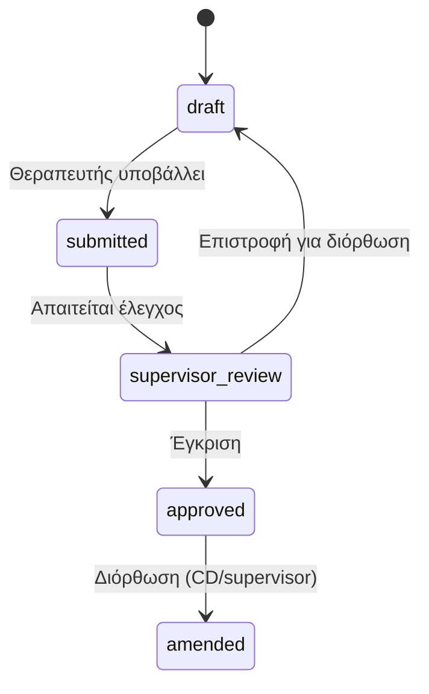

# Evaluation Template System — Architecture

**Status:** Architecture (not implemented)  
**Last updated:** 2026-05-15  
**Parent:** [clinical-core-architecture.md](./clinical-core-architecture.md)

---

## 1. Purpose

Standardize **specialty-specific evaluations** with fixed structure, scoring, supervisor review, and PDF/report generation — while allowing org-level customization and future specialties.

---

## 2. Specialty catalog (v1)

| Code | Label (EL) | Default template version |
|------|------------|---------------------------|
| `speech_therapy` | Λογοθεραπεία | `logotherapeia-v1` |
| `occupational_therapy` | Εργοθεραπεία | `ergotherapeia-v1` |
| `psychotherapy` | Ψυχοθεραπεία | `psychotherapeia-v1` |
| `special_education` | Ειδική Διαπαιδαγώγηση | `eidiki-v1` |
| `executive_functions` | Επιτελικές Λειτουργίες | `epitelikes-v1` |
| `social_skills` | Κοινωνικές Δεξιότητες | `koinonikes-v1` |
| `parent_counseling` | Συμβουλευτική Γονέων | `goneis-v1` |
| `other` | Άλλο | Org-defined |

**Extensibility:** `evaluation_template_definitions` keyed by `discipline_code` + `version`; UI lists only published templates.

---

## 3. Template definition schema

### 3.1 `evaluation_template_definitions`

| Field | Description |
|-------|-------------|
| `id` | uuid |
| `organization_id` | nullable — null = platform default |
| `discipline_code` | Specialty |
| `version` | semver string `1.0.0` |
| `title_el` | Display name |
| `schema_json` | Template structure (see below) |
| `status` | `draft`, `published`, `archived` |
| `published_at` | |

### 3.2 `schema_json` structure

```json
{
  "sections": [
    {
      "id": "anamnesis",
      "titleEl": "Αναγνωστικό στοιχείο",
      "order": 1,
      "fields": [
        {
          "id": "referral_reason",
          "type": "long_text",
          "labelEl": "Λόγος παραπομπής",
          "required": true
        }
      ]
    },
    {
      "id": "assessment",
      "titleEl": "Αξιολόγηση",
      "order": 2,
      "fields": [
        {
          "id": "articulation_score",
          "type": "score_0_5",
          "labelEl": "Άρθρωση",
          "domainCode": "speech_language",
          "required": false
        },
        {
          "id": "observations",
          "type": "observations",
          "labelEl": "Παρατηρήσεις",
          "required": true
        }
      ]
    },
    {
      "id": "conclusions",
      "titleEl": "Συμπεράσματα",
      "order": 3,
      "fields": [
        { "id": "conclusions", "type": "long_text", "labelEl": "Συμπεράσματα", "required": true },
        { "id": "recommendations", "type": "long_text", "labelEl": "Συστάσεις", "required": true }
      ]
    }
  ],
  "supervisorReviewRequired": true,
  "reportLayoutId": "evaluation-standard-el"
}
```

### 3.3 Field types

| Type | Storage | UI |
|------|---------|-----|
| `short_text` | string | Input |
| `long_text` | string | Textarea |
| `number` | number | Input |
| `score_0_5` | 0–5 | Chip row (same scale as goals) |
| `single_select` | string | Dropdown |
| `multi_select` | string[] | Checkboxes |
| `date` | date | Date picker |
| `boolean` | boolean | Toggle |
| `observations` | structured list | Timestamped bullets |
| `file_attachment` | storage ref | Upload (Phase 2) |

---

## 4. Evaluation instance

### 4.1 `clinical_evaluations`

| Field | Description |
|-------|-------------|
| `id` | uuid |
| `child_id` | |
| `template_definition_id` | FK |
| `discipline_code` | Denormalized |
| `therapist_user_id` | Author |
| `evaluation_date` | |
| `responses_json` | Field id → value |
| `status` | `draft`, `submitted`, `supervisor_review`, `approved`, `amended` |
| `supervisor_user_id` | Reviewer |
| `supervisor_notes` | Text |
| `supervisor_reviewed_at` | |
| `visibility` | `clinical_general` (default) — confidential fields use nested paths |
| `pdf_storage_path` | Generated artifact |

### 4.2 Workflow



---

## 5. Fixed sections (all templates)

Every published template **must** include these section ids (may be empty for specialty):

| Section id | Title (EL) | Purpose |
|------------|------------|---------|
| `context` | Πλαίσιο / αναγνωστικό | Referral, setting |
| `assessment` | Αξιολόγηση | Structured + scoring fields |
| `observations` | Παρατηρήσεις | Clinical observations |
| `conclusions` | Συμπεράσματα | |
| `recommendations` | Συστάσεις | |

Specialty-specific sections insert between `context` and `conclusions`.

---

## 6. Scoring → domains & charts

- Fields with `domainCode` feed [clinical-progress-charts.md](./clinical-progress-charts.md) as **evaluation baseline snapshots** (distinct from session goal scores).  
- Store snapshot: `evaluation_domain_scores` (evaluation_id, domain_code, score).

---

## 7. Supervisor review

| Rule | |
|------|--|
| Template flag `supervisorReviewRequired` | Blocks `approved` until supervisor action |
| Supervisor in scope | [therapist-access-control.md](./therapist-access-control.md) |
| Review UI | Side-by-side: template sections + comment per section |
| Therapist cannot edit after submit | Unless returned to draft |

---

## 8. Report generation

| Output | Content |
|--------|---------|
| PDF (parent-safe) | Excludes confidential field paths |
| PDF (full clinical) | All fields for file |
| Progress report excerpt | Pulls conclusions + domain scores |

**Engine:** Template `reportLayoutId` maps sections to HTML/PDF blocks (reuse reports module patterns).

---

## 9. UX (Greek)

**Child tab «Αξιολογήσεις»:**

- List: ημερομηνία, ειδικότητα, κατάσταση, θεραπευτής  
- CTA: «Νέα αξιολόγηση» → pick specialty → load template  
- Form: sticky section nav; autosave draft  
- Submit → «Υποβολή για έλεγχο επόπτη»

---

## 10. Versioning

- Instances **lock** to `template_definition_id` at creation.  
- Publishing new template version does not mutate old evaluations.  
- Org may clone platform default and customize fields (org_id set).

---

## 11. Access control

| Role | Create | View | Approve |
|------|--------|------|---------|
| Therapist (assigned) | Own specialty | All on child (assigned) | No |
| Supervisor | In scope | In scope | Yes |
| CD | Yes | Yes | Yes |
| Secretary | No | No | No |

Audit: view/export evaluation → `clinical_access_audit_log`.
