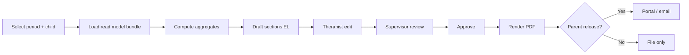

# Progress Report Generation — Architecture

**Status:** Architecture (not implemented)  
**Last updated:** 2026-05-15  
**Parent:** [clinical-core-architecture.md](./clinical-core-architecture.md)  
**Depends on:** [goal-scoring-system.md](./goal-scoring-system.md), [clinical-progress-charts.md](./clinical-progress-charts.md), [evaluation-template-system.md](./evaluation-template-system.md), [confidential-clinical-notes.md](./confidential-clinical-notes.md)

---

## 1. Purpose

Generate **periodic clinical progress reports** from structured data (goal scores, sessions, evaluations, domains) with:

- Parent-safe default export  
- Optional **confidential addendum** (separate document)  
- Greek narrative sections + embedded charts  

Integrates with existing **Reports** module (`lib/reports/`) as `ReportRequest` type `progress_report`.

---

## 2. Report types

| Type | Code | Audience |
|------|------|----------|
| Interdisciplinary progress | `progress_report` | Parents (approved), file, referrals |
| Specialty progress | `specialty_progress_report` | Single discipline focus |
| Confidential addendum | `confidential_addendum` | CD, supervisors, management |

---

## 3. Generation inputs

| Source | Used for |
|--------|----------|
| `therapy_goals` + `session_goal_scores` | Per-goal progress, tables, sparklines |
| Session note blocks (`clinical_general`) | Qualitative summary |
| `clinical_evaluations` (approved) | Assessment snapshot, recommendations |
| Domain aggregates | Domain section |
| Specialty aggregates | Per-specialty section |
| Interdisciplinary goals | All specialties on child |
| **Excluded by default** | `confidential`, `supervisor_only` (unless addendum) |

---

## 4. Report document structure (parent-safe)

### 4.1 Sections (fixed order)

| # | Section (EL) | Content |
|---|--------------|---------|
| 1 | Στοιχεία παιδιού | Name, DOB, period, center (no confidential identifiers) |
| 2 | Περίοδος αναφοράς | start–end dates |
| 3 | Ειδικότητες που συμμετείχαν | List disciplines with active assignments |
| 4 | Στόχοι που εργάστηκαν | Table: title, baseline, current avg, target, status |
| 5 | Πρόοδος ανά στόχο | Mini chart or score table |
| 6 | Πρόοδος ανά ειδικότητα | Summary paragraph + avg trend |
| 7 | Πρόοδος ανά τομέα | Domain bar chart |
| 8 | Ποιοτική κλινική σύνοψη | NLP-assisted draft from notes (human edit required) |
| 9 | Συστάσεις | Merged from evaluations + therapist input |
| 10 | Στόχοι επόμενης περιόδου | Selected active/upcoming goals |

### 4.2 Metadata

```typescript
type ProgressReportDraft = {
  childId: string;
  periodStart: string; // YYYY-MM-DD
  periodEnd: string;
  specialtyCodes: string[];
  includedGoalIds: string[];
  qualitativeSummaryEl: string;
  recommendationsEl: string;
  nextPeriodGoalIds: string[];
  chartSnapshots: { domainCode: string; imageRef: string }[];
  excludeConfidential: true; // always for parent PDF
  status: "draft" | "supervisor_review" | "approved" | "released_to_parent";
};
```

---

## 5. Generation pipeline



### 5.1 Read model function

```typescript
// Target: lib/clinical/reports/build-progress-report-model.ts

function buildProgressReportModel(
  ctx: SessionContext,
  childId: string,
  period: DateRange
): ProgressReportModel;
```

**Guards:** `assertClinicalChildAccess`; strip confidential in mapper.

### 5.2 Draft text generation (v1)

- Rule-based snippets: «Ο/Η {child} πέτυχε μέση βαθμολογία {avg} στον στόχο {title}…»  
- Therapist **must** edit before submit — no auto-send to parents.

---

## 6. Workflow & roles

| Step | Role |
|------|------|
| Initiate draft | Therapist (assigned) or supervisor |
| Edit narrative | Therapist |
| Review | Supervisor |
| Approve for file | Supervisor or CD |
| Release to parent | Supervisor/CD + optional parent acknowledgment |
| Confidential addendum | CD / supervisor only — parallel track |

Link to Reports kanban: column «Έλεγχος», «Έγκριση», «Παράδοση».

---

## 7. Confidential addendum (optional)

Generated separately — see [confidential-clinical-notes.md](./confidential-clinical-notes.md).

| Section (EL) | Source |
|--------------|--------|
| Εμπιστευτικές κλινικές σημειώσεις | `confidential` blocks in period |
| Θέματα εποπτείας | `supervisor_only` |
| Δείκτες κινδύνου | Structured flags |
| Εσωτερικές συστάσεις | CD input |

**Never** auto-attach to parent PDF.

---

## 8. Charts in PDF

- Render server-side (headless) or pre-export PNG from client at approve time.  
- Include: domain bar, top 5 goal lines, baseline vs current table.  
- Watermark: «Πρόχειρο» until approved.

---

## 9. Therapist obligations linkage

Report due triggers:

| Obligation | Rule |
|------------|------|
| `report_due` | No approved report in last N days (org config, e.g. 90) |
| `report_draft_stale` | Draft &gt; 14 days |
| Per specialty | Each discipline may require separate specialty report |

See clinical-core § Therapist Obligations.

---

## 10. UX (Greek)

**Child tab «Αναφορές»:**

1. «Νέα αναφορά προόδου»  
2. Date range presets: «Τρίμηνο», «Τελευταίες 12 εβδομάδες»  
3. Preview split-pane: PDF preview + edit panel  
4. Toggle sections on/off (e.g. exclude specialty)  
5. «Υποβολή για έλεγχο» / «Έγκριση» / «Έκδοση σε γονέα»  
6. Separate button: «Εμπιστευτικό παράρτημα» (gated)

---

## 11. Storage & versioning

| Artifact | Table / storage |
|----------|-----------------|
| Draft JSON | `clinical_progress_reports.draft_json` |
| Approved PDF | object storage + `pdf_storage_path` |
| Version | Increment on amend; keep prior PDF read-only |

---

## 12. API summary

| Endpoint / action | Description |
|-------------------|-------------|
| `createProgressReportDraft` | Start |
| `updateProgressReportDraft` | Edit |
| `submitProgressReportForReview` | |
| `approveProgressReport` | |
| `generateProgressReportPdf` | |
| `createConfidentialAddendum` | Parallel |
| `releaseReportToParent` | Portal push + audit |

---

## 13. Testing checklist

- [ ] Confidential note text absent from parent PDF  
- [ ] Goal scores match chart for same period  
- [ ] Therapist without assignment cannot create draft  
- [ ] Secretary API returns no report body  
- [ ] Addendum requires CD/supervisor role  
- [ ] Audit on PDF export and parent release
